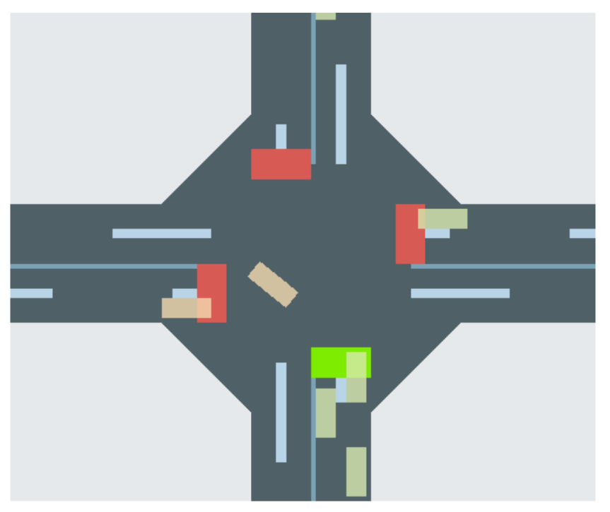
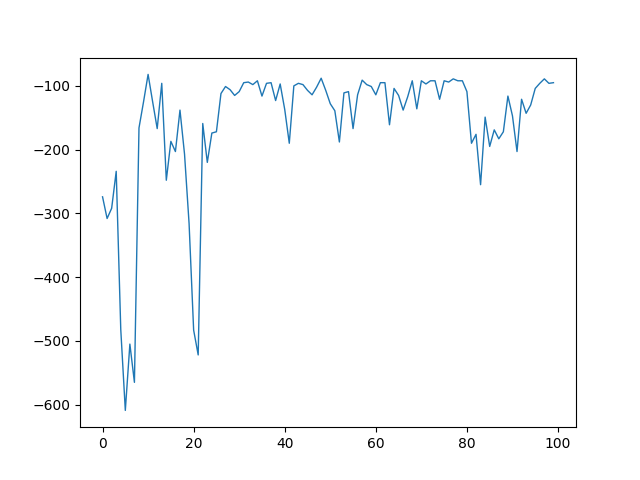

# RL Q-Learning
Implement a Q learning algorithm with gym library to control redlights for reducing traffic

## Prerequisites
- Python 3.6+
- gym

## Environment
<h3 align="center">
  
</h3>

## Evaluation

<h3 align="center">
  
</h3>
As you can see, the agent's given reward is getting stablized through the time.

